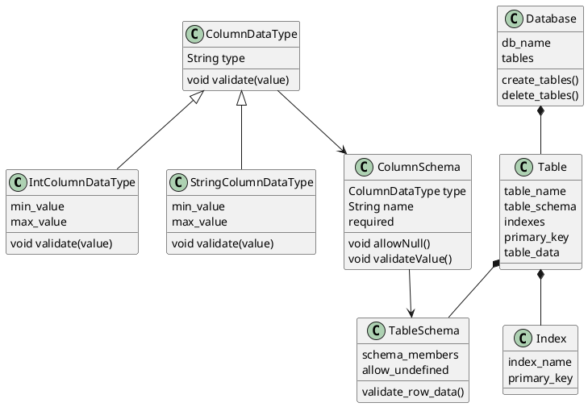

Indexes can be implemented using [balanced trees](https://en.wikipedia.org/wiki/Balanced_tree), [B+ trees](https://en.wikipedia.org/wiki/B%2B_tree), and [hashes](https://en.wikipedia.org/wiki/Hash_table)

#### Type of index:
Primary Index
Fussy Index
reversed index
GSI
LSI




TableSchema
validate_row_data(){
validates row data  
Multi level validation  
TableSchema : validates any undefined values  
SchemaMember : validates null check  
Column_data_type: validates value type and ranges.
}
- **ColumnDataType class**: This includes different data types we can use for our columns. Here we can also have custom validations on each of the datatypes.

- **SchemaMember class**: This is the actual column that our table schema would use. Here we can define the column name, type, and different validations on the column like null allowed, required or not, etc.

- **TableSchema class**: This is the schema that will be used by the table to validate and store each row. Here we can define all schema members and validation methods as well.

SchemaMember
def validate_value(self, val){

	//validates column value  
	if val is None and not allow_none:  
	raise InvalidValueException(f"None_not_allowed_in_{self.column_name}")  
	return self.column_type.validate(val)
}


Index:
- **Index class**: This is the base for implementing different types of indexes defined by index_name and index_storage. Provides methods to index/query data and also to remove indexed value as well.
Reverse Index:
![[Screenshot 2024-07-01 at 7.39.30 PM.png]]

```def table_flow(cls):  
# create schema  
user_schema = TableSchema()  
user_schema.add_schema_member(SchemaMember("user_id", StrDataType(0, 10), required=True))  
user_schema.add_schema_member(SchemaMember("user_name", StrDataType(0, 50)))  
user_schema.add_schema_member(SchemaMember("user_age", IntDataType(0, 100), required=False))  
  
# Create Table  
user_table = Table(table_name="users", table_schema=user_schema, primary_key="user_id")  
  
# create index  
user_table.create_index("user_name", "FUZZY")  
  
# insert seed data  
user_table.insert_data({"user_id": "user1", "user_name": "new user", "user_age": 20})  
user_table.insert_data({"user_id": "user2", "user_name": "improved user"})  
user_table.insert_data({"user_id": "user3", "user_name": "diff guy", "user_age": 30})  
  
print(user_table.filter_data({"user_name": "user"}))  
# out : [{'user_id': 'user1', 'user_name': 'new user', 'user_age': 20},  
# {'user_id': 'user2', 'user_name': 'improved user'}]  
  
print(user_table.filter_data({"user_name": "user", "user_age": 20}))  
# out : [{'user_id': 'user1', 'user_name': 'new user', 'user_age': 20}]  
  
user_table.delete_data("user2")  
print(user_table.filter_data({"user_name": "user"}))  
# out : [{'user_id': 'user1', 'user_name': 'new user', 'user_age': 20}]
```